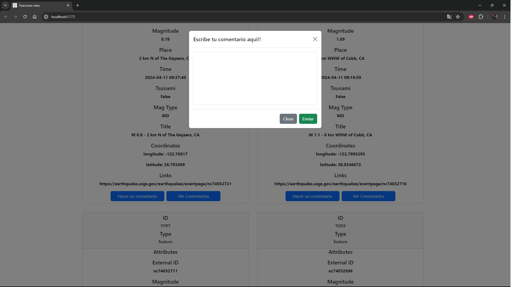
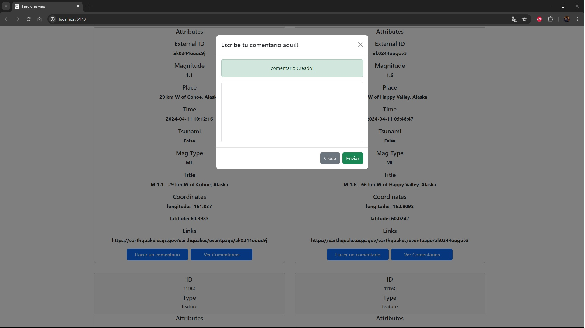

# Leeme!!
# este proyecto esta hecho en Ruby con rails, Javascript, ReactJs para los estilos se utilizo Boostrap  
-Primero instala las dependencias de Ruby y react  
-Configura el usuario y la contraseña de la base de datos a utilizar en config/database.yml  
-Correr las migraciones para la base de datos con el comando {rails db:migrate}  
-Ejecuta la tarea en la terminal con el comando {rails sync_data_from_api:sync}  
-Usamos el comando para correr el servidor de back end con el {comando rails s}  
(ojo) SI UTILIZAS UNA DIRECCION DE FRONT END DIFERENTE A ((http://localhost:5173)) CAMBIARLA EN LA RUTA CONFIG/INITIALIZERS/CORS.RB  
-Por ultimo iniciar el front con el comando {npm run dev}  
-La api cuenta con las siguientes rutas  
-/api/features/:feature_id/comments => (POST)  
-/api/features/:feature_id/comments => (GET)  
-http://127.0.0.1:3000/api/features?page=1&per_page=100&filters[mag_type]=mw => (GET)  
#Espero que este proyecto sea de su agrado para cualquier pregunta o feedback no dude en contactarme!!  

#Acontinuacion algunas imagenes de la app!

  
#Espero que este proyecto sea de su agrado para cualquier pregunta o feedback no dude en contactarme!!

